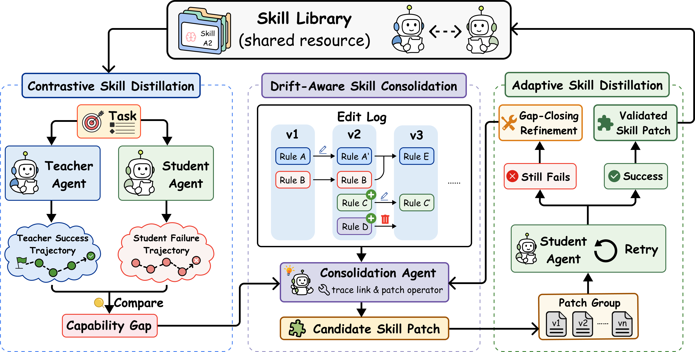

<div align="center">

<h1>SKILL-KD</h1>

<p><strong>Contrastive Skill Distillation for LLM Agents</strong></p>

<p>
  <a href="https://arxiv.org/abs/2607.28048"></a>
  
</p>

<p>
  <a href="#abstract">Abstract</a> |
  <a href="#overview">Overview</a> |
  <a href="#setup">Setup</a> |
  <a href="#benchmarks">Benchmarks</a> |
  <a href="#run">Run</a> |
  <a href="#citation">Citation</a>
</p>

</div>

## Abstract

Skill-based prompting has become a practical mechanism for improving large language model (LLM) agents, yet existing skill acquisition methods often treat skills as experience summaries, memory entries, or direct summaries of successful demonstrations.
This creates a mismatch for weaker student agents: when a student fails because it lacks task knowledge or operational strategy, its failed trajectory may not contain enough evidence to infer the missing behavior, while the teacher trajectory may be too implicit to be internalized as reusable guidance.
We propose **SKILL-KD**, a contrastive skill distillation framework that treats skills as an explicit distillation medium between agents of different capabilities.
Given a student failure and the teacher trajectory on the same task, SKILL-KD distills their actionable discrepancy into a textual skill patch, evaluates the patch by re-running the student, and iteratively refines the patch when the student still fails.
To prevent repeated local updates from causing skill drift, SKILL-KD further maintains trace-linked edit histories and performs **Drift-Aware Skill Consolidation**, deciding whether each patch should add a new rule, delete or modify an existing rule, or be skipped.
Across five agent benchmarks and two student settings, SKILL-KD consistently improves frozen student agents over fixed-model adaptation baselines.

## Overview

<p align="center">
  
</p>

<p align="center"><em>SKILL-KD distills teacher-student behavioral gaps into reusable skills through adaptive student retries and drift-aware skill consolidation.</em></p>

## Setup

```bash
brew install python@3.11
brew install --cask libreoffice

bash scripts/setup/setup_all.sh
cp .env.example .env
```

Set `DASHSCOPE_API_KEY` in `.env`, or configure any OpenAI-compatible endpoint
with `SKILL_KD_BASE_URL` and `SKILL_KD_API_KEY_ENV`.

The setup scripts download public benchmark data and materialize the exact
train/validation/test subsets from pinned manifests checked into
`data/<benchmark>/splits/`.

Skip individual benchmark preparation with:
`SKIP_ALF=1`, `SKIP_SSB=1`, `SKIP_SEARCHQA=1`, `SKIP_LIVEMATHC=1`,
or `SKIP_DOCVQA=1`.

## Benchmarks

| Benchmark | Train | Val | Test | Metric |
|---|---:|---:|---:|---|
| SearchQA | 400 | 200 | 1400 | EM / F1 |
| SpreadsheetBench | 80 | 40 | 280 | Workbook diff |
| DocVQA | 107 | 53 | 374 | ANLS |
| LiveMathC | 35 | 18 | 124 | Exact match |
| ALFWorld | 39 | 18 | 134 | Environment success |

DocVQA is multimodal; use a vision-capable student model for meaningful scores.

## Run

Use `scripts/run.sh` as the single entry point.

```bash
# Evolve + test
EXP_NAME=my-run \
  BENCHMARKS="searchqa spreadsheetbench docvqa livemathc alfworld" \
  STUDENT_MODEL=qwen3-4b \
  TEACHER_MODEL=qwen3.6-plus \
  TRAIN_LIMIT=50 EVAL_LIMIT=50 \
  bash scripts/run.sh

# Test only with a saved skill
EXP_NAME=baseline MODE=test \
  BENCHMARKS="spreadsheetbench" \
  SKILL=results/<run>/spreadsheetbench/skills/final.md \
  STUDENT_MODEL=qwen3-4b \
  bash scripts/run.sh

# Resume
RESUME=1 EXP_NAME=my-run bash scripts/run.sh
```

Important environment variables:

| Variable | Default | Description |
|---|---|---|
| `MODE` | `evolve+test` | `evolve`, `test`, or `evolve+test` |
| `BENCHMARKS` | `spreadsheetbench` | Space-separated benchmark names |
| `STUDENT_MODEL` | `qwen3-8b` | Student model |
| `TEACHER_MODEL` | `qwen3.5-flash` | Teacher and critic model |
| `TRAIN_LIMIT` | all | Optional training subsample |
| `EVAL_LIMIT` | all | Optional eval subsample |
| `MAX_ITERS` | `3` | Max adaptive skill-edit rounds per task |
| `SKILL_KD_BASE_URL` | DashScope | OpenAI-compatible endpoint |
| `SKILL_KD_API_KEY_ENV` | `DASHSCOPE_API_KEY` | Env var holding the API key |

## Results

Runs are written to `results/<run_id>/`. This source release does not include
full experiment trajectories, metrics, or raw outputs. It keeps final skill
snapshots at:

```text
results/4b-skills/<benchmark>/skills/final.md
results/35b-skills/<benchmark>/skills/final.md
```

To inspect newly generated results:

```bash
python viz_server.py            # http://localhost:8080
python viz_server.py 9000
```

## Layout

```text
src/pact/                  Core algorithm, adapters, prompts, skill ops
configs/benchmarks/        Benchmark configs
configs/skills/            Initial skill files
scripts/setup/             Data preparation
scripts/run.sh             Experiment launcher
tests/                     Unit tests
```

## Tests

```bash
pytest -q
```

Tests mock LLM calls and do not require network access.

## Citation

```bibtex
@misc{shi2026skillkdcontrastiveskilldistillation,
  title={SKILL-KD: Contrastive Skill Distillation for LLM Agents},
  author={Qiming Shi and Yibo Dou and Jiawen Zhu and Yulong Tao and Linbo Jin and Zhaolu Kang and Yunfan Zhou and Di Weng},
  year={2026},
  eprint={2607.28048},
  archivePrefix={arXiv},
  primaryClass={cs.AI},
  url={https://arxiv.org/abs/2607.28048},
}
```
